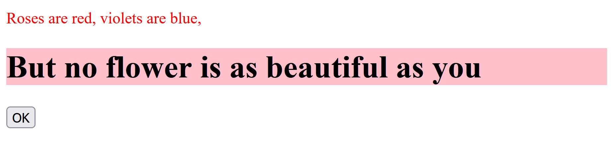

# Vad är DOM?
DOM står för _Document Object Model_. DOM kan modifieras med hjälp av Javascript.

# Omorganisera kod
Tack vare DOM, så går det att separera koden till tre "delar":
1. Struktur (HTML)
2. Stil/design (CSS)
3. Funktion (Javascript)
Detta med hjälp av externa filer som kan laddas in via något av följande:
```html
<head>
    ...
    <link type="text/css" rel="stylesheet" href="./path/to/file.css">
    <script defer type="text/javascript" src="./path/to/script.js"></script>
    ...
</head>
```
`<link>` används för _style sheets_, alltså CSS. Medan `<script>` används för Javascript.

## Exempel på filstruktur
```
Project
|- scripts
|  |- script.js
|- style
|  |- styles.css
|- html
   |- index.html
```

# Struktur på DOM
DOM skapar en struktur som är som en hierarki, eller _familj_, med de olika elementen. Man kan säga att det är organiserade som "lådor".
```
,-------------------------------------,
| html                                |
| ,---------------------------------, |
| | head                            | |
| | ,-----------------------------, | |
| | | title                       | | |
| | '-----------------------------' | |
| | ,-----------------------------, | |
| | | link                        | | |
| | '-----------------------------' | |
| '---------------------------------' |
| ,---------------------------------, |
| | body                            | |
| | ,-----------------------------, | |
| | | h1                          | | |
| | '-----------------------------' | |
| | ,-----------------------------, | |
| | | p                           | | |
| | '-----------------------------' | |
| '---------------------------------' |
'-------------------------------------'
```

# Modifiera ett DOM-element
För att ändra ett element måste man först hitta element, det finns flera sätt för det:
```js
document.querySelector("selector")    // Hitta ett element med CSS-selector
document.querySelectorAll("selector") // Hitta alla element med CSS-selector

document.getElementById("id")  // Hitta ett element via ett ID
document.getElementsById("id") // Hitta alla element via ett ID

document.getElementByTagName("id")  // Hitta ett element via dess tag
document.getElementsByTagName("id") // Hitta alla element via dess tag
```

## Exempel 1
HTML:
```html
<p class="change-me">Hello world!</p>
```
Förväntat resultat:
> Hello world!

Med Javascript:
```js
const element = document.querySelector(".change-me")
element.innerText = "Bye bye world!"
```
Nytt förväntat resultat:
> Bye bye world!

## Exempel 2
HTML:
```html
<!DOCTYPE html>
<html lang="en">
<head>
    <meta charset="UTF-8">
    <meta http-equiv="X-UA-Compatible" content="IE=edge">
    <meta name="viewport" content="width=device-width, initial-scale=1.0">
    <title>Change DOM</title>
    <script src="./main.js" defer></script>
</head>
<body>
    <p id="my-paragraph" style="color: red">Roses are red, violets are blue,</p>
    <h1 id="my-h1" style="background-color: pink">But no flower is as beautiful as you</h1>
    <button id="my-button">OK</button>
</body>
</html>
```
Javascript:
```js
const myButton = document.querySelector("#my-button")
const myH1     = document.querySelector("#my-h1")

myButton.addEventListener(
    "click",
    () => myH1.innerText = "Unexpected error on line 32."
)
```
Förväntat resultat:

Förväntat resultat när knappen ("OK") trycks:


# Bra metoder
```js
// Ändra text i element:
element.innerText = "New text"

// Ändra bakgrundsfärg:
element.style.background = "#67fe45"

// Ändra vad som händer när en knapp klickas:
button.addEventlistener(
    "click",
    event => {
        // Gör saker...
    }
)

// Lägg till ett nytt element i dokumentet eller
// inuti ett annat element:
const newElement = documentt.createElement("...")
document.appendChild(newElement)
element.appendChild(newElement)

// Kolla om ett element har en specifik klass:
element.classList.contains("class") // returns true | false

// Växla ett element:
element.classList.toggle("class", condition)
// Lägger till klassen "class" om den inte finns,
// om den finns, så ta bort den. "class" kan nu
// ändras med hjälp av CSS.
// Condition kan användas för att berätta när
// klassen ska bytas ut, t.ex. `i < 10`
// Om ingen condition specifieras så tolkas det
// som att den är `true`.

// Byt ut en klass:
element.classList.replace("class1", "class2")
// Byter ut "class1" mot "class2".

// Lägg till eller ta bort en klass:
element.classList.add("class")
element.classList.remove("class")
// ... eller på flera klasser:
element.classList.add("class1", "class2", "class3")
element.classList.remove("class1", "class2", "class3")

// Gör något på flera element:
document.querySelectorAll("selector")
    .forEach(
        element => {
            // Gör något...
        }
    )
```